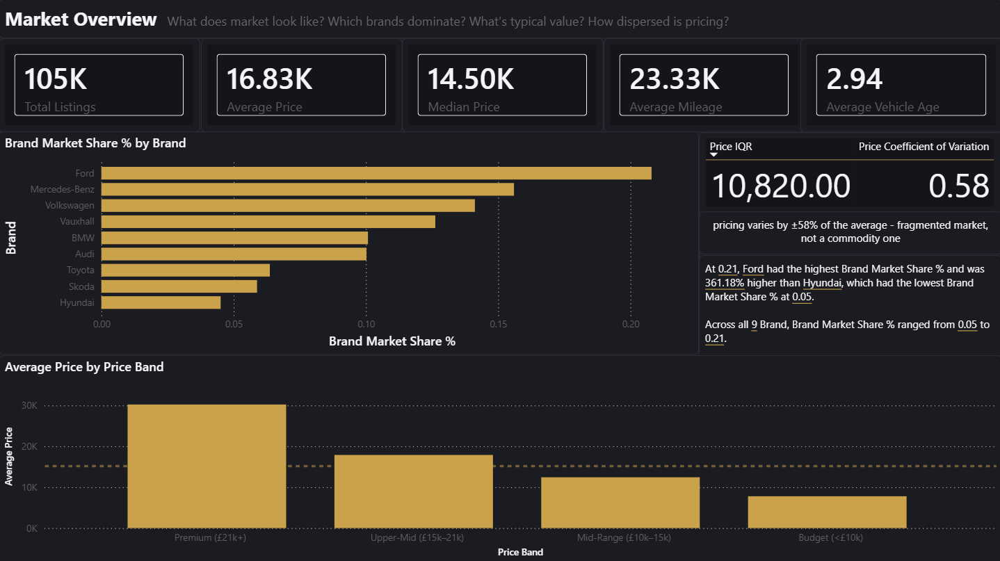
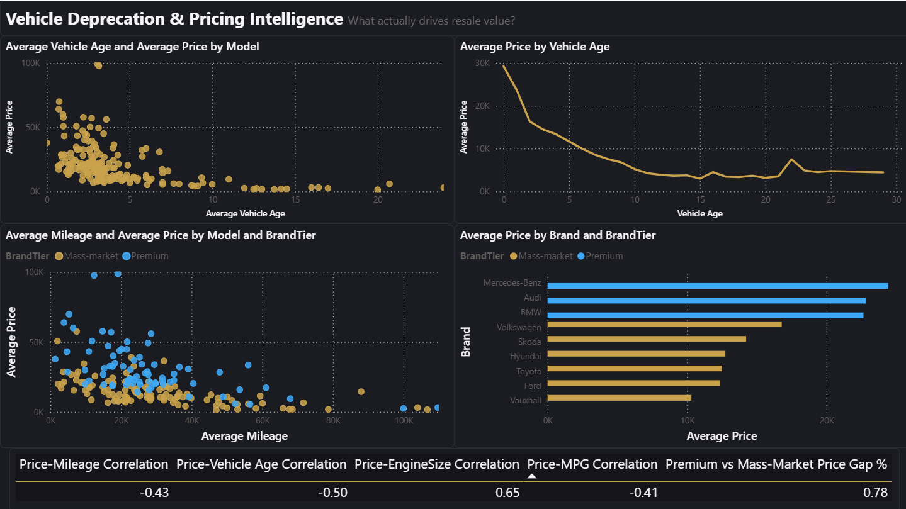
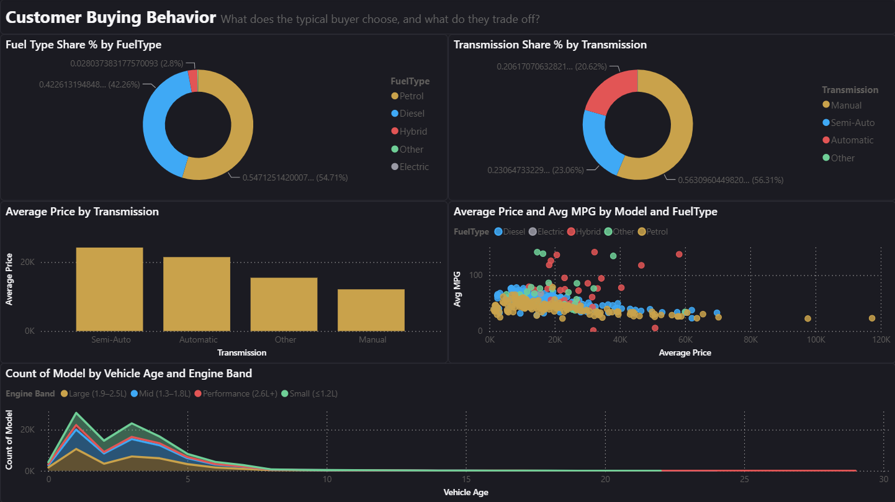
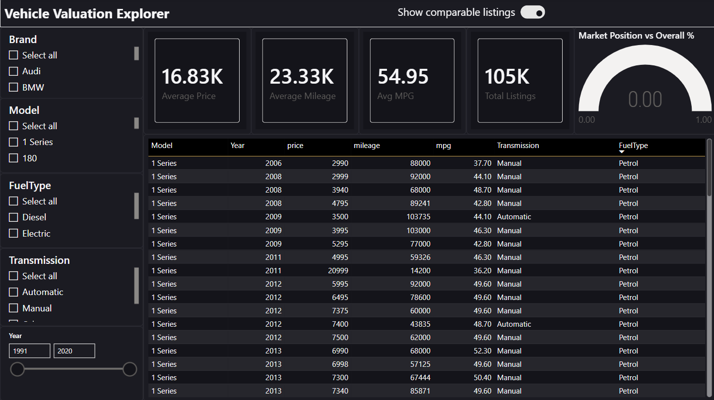
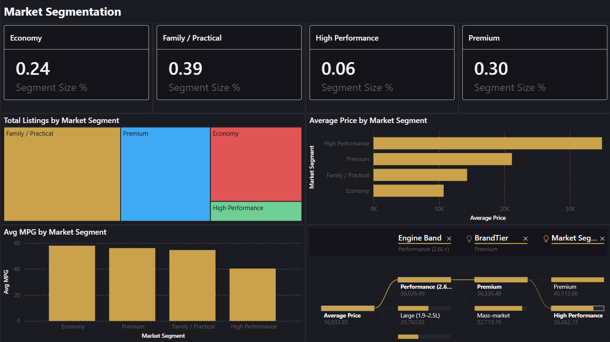

# 🚗 UK Used Car Market Analytics — Power BI Dashboard

> A 5-page Power BI report analysing pricing dynamics, depreciation patterns, customer behaviour, and vehicle value across the UK used car market. Built as a portfolio case study demonstrating end-to-end BI delivery: from raw data with structural gaps to an interactive executive dashboard with actionable commercial recommendations.


---

## 📋 Table of Contents

- [Business Problem](#business-problem)
- [Project Objective](#project-objective)
- [Dataset Overview](#dataset-overview)
- [Tools & Technologies](#tools--technologies)
- [Data Preparation](#data-preparation)
- [Data Model](#data-model)
- [Dashboard Overview](#dashboard-overview)
- [Key Business Insights](#key-business-insights)
- [DAX Measures](#dax-measures)
- [Dashboard Design](#dashboard-design)
- [Business Recommendations](#business-recommendations)
- [Project Screenshots](#project-screenshots)
- [Future Improvements](#future-improvements)
- [Author](#author)

---

## 🧩 Business Problem

Used car marketplaces operate in a fragmented, high-volatility environment where prices vary by up to 58% of the market average across brands, model types, and vehicle age. Without structured analytics, key commercial decisions — inventory purchasing, listing pricing, customer targeting — are made on instinct rather than evidence.

The core challenges this project addresses:

- **Pricing opacity:** Listings span £450 to £159,999 with no clear framework for evaluating whether a vehicle is competitively priced or mispriced for its segment.
- **Depreciation blindspots:** Dealers and buyers rarely quantify how rapidly value decays in the first two years post-registration versus later in a vehicle's life.
- **Undifferentiated inventory strategy:** Without segment-level analysis, marketplace operators cannot distinguish where supply is concentrated versus where margin and customer demand actually sit.
- **Missing manufacturer data:** The raw dataset contained no brand column — only model codes — requiring analytical reconstruction of manufacturer identity across 192 distinct model variants before any brand-level insight could be produced.

---

## 🎯 Project Objective

To design and deliver a professional Power BI analytics product that enables used car marketplace stakeholders to:

- Understand UK used car market structure, pricing norms, and brand dynamics at a glance
- Quantify depreciation rates by vehicle age and identify optimal buy/sell windows
- Analyse customer demand signals through fuel type, transmission, and engine preference trends
- Value any specific vehicle configuration interactively against the market
- Make evidence-based decisions on inventory, pricing strategy, and customer targeting

The intended users are commercial and operational stakeholders: pricing managers, buyers, category leads, and senior management — not data teams.

---

## 📂 Dataset Overview

| Attribute | Detail |
|---|---|
| Source | UK Used Cars dataset (Kaggle — `100,000 UK Used Car Data set`) |
| Size | 104,753 rows × 9 columns |
| Coverage | 9 manufacturers, 192 model variants |
| Registration years | 1991 – 2020 |
| Price range | £450 – £159,999 |

### Raw Features

| Column | Type | Description |
|---|---|---|
| `model` | Text | Vehicle model name (e.g. `Focus`, `3 Series`, `C Class`) |
| `year` | Integer | Registration year |
| `price` | Float | Listing price in GBP |
| `transmission` | Text | Manual / Automatic / Semi-Auto / Other |
| `mileage` | Float | Odometer reading in miles |
| `fuelType` | Text | Petrol / Diesel / Hybrid / Electric / Other |
| `tax` | Float | Annual road tax in GBP |
| `mpg` | Float | Manufacturer-quoted fuel efficiency |
| `engineSize` | Float | Engine displacement in litres |

### Structural Gap Identified

The raw file contained no `brand` or `manufacturer` column. The dataset is a stacked combination of originally separate per-brand CSV files (Audi, BMW, Mercedes-Benz, Ford, Hyundai, Skoda, Toyota, Vauxhall, Volkswagen), with the brand field lost during concatenation. Reconstructing manufacturer from model name was the first and most critical analytical step in this project — documented in detail in the Data Preparation section below.

---

## 🛠 Tools & Technologies

| Tool / Technology | Purpose |
|---|---|
| **Power BI Desktop** | Report authoring, data model, visualisations |
| **Power Query (M)** | Data ingestion, cleaning, transformation, lookup merge |
| **DAX** | Calculated columns, measures library, KPI logic |
| **Python (pandas)** | Exploratory data analysis, correlation analysis, segment validation, lookup table generation |
| **Star Schema Design** | Fact/dimension modelling for report performance |
| **Custom JSON Theme** | Dark premium automotive design system |

---

## 🔧 Data Preparation

The cleaning pipeline is fully documented in [`data_cleaning.ipynb`](data_cleaning.ipynb). This was not a straightforward clean — the raw data had structural problems that required investigative work before a single measure could be written.

### Pipeline Summary

| Stage | Raw → Output | Rows removed |
|---|---|---|
| Initial concatenation | 9 brand CSVs → `uk_used_cars.csv` | — |
| Loaded into Python | 118,150 rows × 16 columns | — |
| Column consolidation + duplicate columns dropped | 118,150 × 10 | — |
| `reference` column dropped | — | — |
| Exact duplicates removed | 118,150 → 114,961 | 3,189 |
| Remaining nulls on core fields dropped | 114,961 → 114,872 | 89 |
| Type coercion (price/mileage/engineSize object→float) | Revealed 8,605 unparseable price rows | — |
| Rows with null `price` dropped | 114,872 → 106,267 | 8,605 |
| Second duplicate pass (post-coercion) | 106,267 → 105,272 | 995 |
| Outlier filters applied | 105,272 → 104,754 | 518 |
| Sentinel price value removed (`123456`) | 104,754 → **104,753** | 1 |
| **Final clean output** | **104,753 rows × 9 columns, 0 nulls** | |

---

### Step 1 — Data Ingestion: Concatenating 9 Brand Files

The source data was not a single file. It was 9 separate brand-specific CSVs (Audi, BMW, Mercedes-Benz, Ford, Hyundai, Skoda, Toyota, Vauxhall, Volkswagen), individually downloaded from Kaggle, then concatenated with `pd.concat`:

```python
files = glob.glob("data/cars/*.csv")
df = pd.concat([pd.read_csv(file) for file in files], ignore_index=True)
df.to_csv("data/raw/uk_used_cars.csv", index=False)
```

This explains why the combined file had **no brand column** — that field existed implicitly in the filename, not in the data itself. Brand reconstruction was therefore the first analytical decision of the project, not a cleaning step.

---

### Step 2 — Column Consolidation (Non-Standard Schemas)

The raw concatenated file had 16 columns, not 9. Several brand CSVs used different column names for the same fields — `tax(£)` vs `tax`, `fuel type` vs `fuelType`, `engine size` vs `engineSize` — and some had additional `mileage2`, `fuel type2`, `engine size2`, and `reference` columns. The result was a wide, sparse frame with large blocks of nulls in the variant columns.

Resolution: `combine_first()` was used to fill nulls in the canonical column from its variant, then all variant columns were dropped.

```python
df['fuelType']   = df['fuelType'].combine_first(df['fuel type']).combine_first(df['fuel type2'])
df['engineSize'] = df['engineSize'].combine_first(df['engine size']).combine_first(df['engine size2'])
df['mileage']    = df['mileage'].combine_first(df['mileage2'])
df['tax']        = df['tax'].combine_first(df['tax(£)'])

df.drop(columns=['fuel type', 'fuel type2', 'engine size', 'engine size2', 'mileage2', 'tax(£)', 'reference'], inplace=True)
```

The `reference` column (AutoTrader listing URLs, e.g. `/ad/25017331`) was present in only ~8% of rows — it was a scraping artifact from one specific brand file, with no analytical value. Dropped.

---

### Step 3 — Missing Value Treatment

After column consolidation, the null picture was:

| Column | Missing (%) | Decision |
|---|---|---|
| `tax` | 16.0% | Imputed by group median, then global median fallback |
| `mpg` | 16.0% | Imputed by group median, then global median fallback |
| `year`, core fields | <0.2% | Rows dropped |

`tax` and `mpg` nulls were concentrated in specific model/fuel-type combinations where the source data was never populated. A two-stage imputation strategy preserved as many rows as possible:

```python
# Stage 1: impute from the median of the same fuel type + engine size group
df['tax'] = df.groupby(['fuelType', 'engineSize'])['tax'].transform(
    lambda x: x.fillna(x.median())
)

# Stage 2: remaining nulls filled with the global median
df['tax'] = df['tax'].fillna(df['tax'].median())
```

Both columns had identical null patterns — confirmed programmatically — so the same logic applied to both. After stage 2, `tax` and `mpg` reached 0 nulls.

---

### Step 4 — Type Coercion and Duplicate Removal

`price`, `mileage`, and `engineSize` were stored as `object` dtype in the raw CSV due to mixed-type entries (numeric values alongside strings like `"POA"` or formatting artefacts). Coerced to float with `errors='coerce'` — non-numeric values silently became `NaN`.

```python
df['price']      = pd.to_numeric(df['price'], errors='coerce')
df['mileage']    = pd.to_numeric(df['mileage'], errors='coerce')
df['engineSize'] = pd.to_numeric(df['engineSize'], errors='coerce')
df['year']       = df['year'].astype(int)
```

This revealed **8,605 rows with no parseable price** — examined individually, these were confirmed to be incomplete listings (null mileage and engineSize co-occurring) rather than recoverable data. Dropped via `dropna(subset=['price'])`.

A second duplicate check after coercion caught a further 995 rows (duplicates that had previously appeared distinct due to type differences). Removed.

---

### Step 5 — Outlier Removal (Data Quality, Not Statistical)

Each filter below was based on inspecting specific rows rather than mechanical IQR cutoffs:

**Registration year anomalies:**
```python
# 2 rows with year == 1970 (Mercedes M Class, Vauxhall Zafira — data entry errors)
# 1 row with year == 2060 (Ford Fiesta — obvious typo for 2006 or 2016)
df = df[(df['year'] >= 1990) & (df['year'] <= 2026)]
```

**MPG > 150 — plug-in hybrid WLTP inflation:**
273 rows, exclusively hybrid vehicles (Audi A3 e-tron, VW Passat GTE, Audi Q7 e-tron), with figures like 188.3 and 166.0 MPG. These are manufacturer-quoted WLTP figures for plug-in hybrids that inflate the combined MPG by assuming charge depletion from a full battery. They are not comparable to combustion or non-plug-in hybrid MPG figures and would distort any fuel efficiency analysis.
```python
df = df[df['mpg'] < 150]
```

**EngineSize == 0 — 242 rows:**
Inspected and found to be valid vehicles with genuine displacement data (VW Up, Tiguan, Audi Q3 etc.) where the engine size was simply not recorded. Unlike `tax` and `mpg`, there was no reliable basis for imputation, and these rows had multiple missing fields. Dropped.
```python
df = df[df['engineSize'] > 0]
```

**Sentinel price value:**
```python
# 1 row: BMW 2 Series, price == 123,456 — a clear placeholder, not a real listing price
df = df[df['price'] != 123456]
```

---

### Step 6 — Final Validation

```python
df.isna().sum()
# All zeros — confirmed

df.shape
# (104753, 9)
```

Clean output saved to `data/used_cars_clean.csv` — the file loaded into Power BI.

---

### Step 7 — Brand Reconstruction (Post-Clean, Pre-Power BI)

With the clean CSV validated, the structural gap — no brand column — was addressed by building a `model_brand_lookup.csv` reference table, mapping all 192 distinct model names to manufacturer and brand tier (`Premium` / `Mass-market`). Validated for 100% coverage before use.

```python
# All 192 models mapped, 0 unmapped rows — confirmed
df['brand'] = df['model'].map(mapping)
df['brand'].isna().sum()  # → 0
```

This lookup is merged in Power Query as a separate `Dim_Model` table, keeping the clean CSV unmodified.

---

### Step 8 — Feature Engineering (Power BI Calculated Columns)

| Column | Logic | Purpose |
|---|---|---|
| `Vehicle Age` | `ReferenceYear - Year` (anchored to 2020, not `TODAY()`) | Depreciation analysis |
| `Price Band` | 4-tier: <£10k / £10–15k / £15–21k / £21k+ | Price distribution |
| `Mileage Band` | 4-tier: <20k / 20–60k / 60–100k / 100k+ mi | Resale value banding |
| `Engine Band` | 4-tier by displacement: ≤1.2L / 1.3–1.8L / 1.9–2.5L / 2.6L+ | Efficiency vs. performance |
| `Market Segment` | Rule-based: Economy / Family/Practical / Premium / High Performance | Page 5 segmentation |
| `Price per 1,000 Miles` | `Price / (Mileage / 1000)` | Normalised value metric |

`Vehicle Age` is deliberately anchored to the dataset's own reference year (2020, the maximum `year` value present), not `TODAY()`. The dataset captures a point-in-time market snapshot — using `TODAY()` would inflate every car's apparent age by 5–6 years, compressing the depreciation curve and producing incorrect insights.

---

## 🗃 Data Model

Star schema with one central fact table and dimension tables for lookup/filtering. Designed for query performance and report clarity over structural complexity.

```
                    Dim_Brand
                  (9 rows — Brand, BrandTier, Country)
                        │
                    Dim_Model
                  (192 rows — Model, Brand FK)
                        │
   Dim_FuelType ──── Fact_Cars ──── Dim_Transmission
   (5 rows)          (104,753 rows)      (4 rows)
                        │
               Param_ReferenceYear
               (What-If Parameter, 2010–2020)
```

**Design decisions:**

- All DAX measures live in a dedicated **Measures** table (empty query, no rows) — keeps the field list clean and models a real-world BI team convention.
- `BrandTier` is flattened onto `Fact_Cars` rather than requiring a relationship join for a 9-row lookup — a pragmatic choice at this data scale.
- The `Param_ReferenceYear` What-If Parameter replaces a hard-coded year — this is the detail that separates a thoughtful model from a brittle one.
- Relationships are set to single-direction filtering to avoid ambiguity in cross-filter context.

---

## 📊 Dashboard Overview

### Page 1 — Market Overview (Executive Dashboard)

> *"What does the UK used car market look like, and who controls it?"*

A CEO-style summary page designed to be readable in under 60 seconds. No interactive exploration required — this page answers the top-line business questions with a clean grid of KPIs and two focused visuals.

**KPI Cards:**

| Metric | Value |
|---|---|
| Total Listings | 104,753 |
| Average Price | £16,834 |
| Median Price | £14,500 |
| Average Mileage | ~26,000 mi |
| Average Vehicle Age | ~3 years |

The gap between mean and median price (£2,334) is surfaced explicitly — a right-skewed distribution driven by a high-value long tail — because it matters for how pricing benchmarks are communicated internally. Teams referencing average price will systematically overstate what a typical buyer is spending.

**Visuals:**
- Bar chart: Brand market share by listing count (Ford 20.8%, Mercedes-Benz 15.6%, Volkswagen 14.1%, Vauxhall 12.6%, BMW 10.1%, Audi 10.0%, Toyota 6.4%, Skoda 5.9%, Hyundai 4.5%)
- Column chart: Price distribution by band — reveals the market is concentrated in the £10–21k range with a meaningful high-end tail
- Supporting callout: Price Coefficient of Variation (0.58) quantifying market price dispersion

---

### Page 2 — Vehicle Depreciation & Pricing Intelligence

> *"What drives vehicle resale value, and which factors matter most?"*

The analytical centrepiece of the report. Every visual is built around a specific commercial question rather than a charting default.

**Visuals:**

- **Depreciation curve** (line chart, Average Price by Vehicle Age, 0–14 years): The sharpest drop is in years 1–2, where average resale value falls from £29,186 to £16,334. The curve then flattens to a steady annual decline of roughly 10–15%, with a clear inflection point around year 4.
- **Price vs. Vehicle Age scatter** (scatter with trend line, colored by BrandTier): Shows premium brand premium is sustained even at higher vehicle ages — the gap between tiers doesn't close linearly.
- **Price vs. Mileage scatter** (colored by BrandTier, with per-tier trend lines): Quantifies mileage penalty. The relationship is not uniform — premium vehicles show a shallower mileage-driven price decline than mass-market models.
- **Average Price by Brand** (sorted bar chart): Ranks all 9 manufacturers. Mercedes-Benz leads at £24,419, Vauxhall sits at the bottom at £10,313.
- **Key Influencers visual**: Power BI's built-in statistics engine independently surfaces the same driver ranking confirmed by correlation analysis — engine size is the strongest upward predictor of price, more so than mileage or age alone.

**Correlation summary (from data):**

| Variable | Correlation with Price |
|---|---|
| Engine Size | +0.65 |
| Vehicle Age | −0.50 |
| Mileage | −0.43 |
| MPG | −0.41 |
| Tax | +0.30 |

---

### Page 3 — Customer Buying Behavior

> *"What types of vehicles are customers choosing, and what do their choices reveal about preferences?"*

Demand-side analysis surfacing the patterns that should inform inventory mix and marketing targeting decisions.

**Visuals:**

- **Fuel type share** (donut): Petrol 54.7%, Diesel 42.3%, Hybrid 2.8%, Electric <0.1% — diesel is still dominant in resale supply despite declining new-car sales, concentrated in larger/premium vehicles.
- **Transmission share** (donut): Manual 56.3%, Semi-Auto 23.1%, Automatic 20.6% — semi-automatic outprices full automatic (£24,225 vs £21,462 average), explained by its concentration in premium DCT/dual-clutch trim levels, not intrinsic gearbox value.
- **Average price by transmission** (clustered bar): Makes the semi-auto premium legible at a glance; annotated to avoid the false interpretation that buyers should seek semi-auto as a budget automatic.
- **MPG vs. Price scatter** (colored by fuel type): MPG negatively correlates with price for Petrol (−0.61) and Diesel (−0.62) — higher-spec, higher-displacement engines return worse MPG but command higher prices. The correlation is near-flat for Hybrid (−0.10), indicating hybrid buyers are not making efficiency-price trade-offs the same way combustion buyers are.
- **Engine size share by registration year** (stacked chart): Shows whether buyer preference for engine displacement has shifted across model years in this dataset.

---

### Page 4 — Vehicle Valuation Explorer

> *"What should this specific vehicle configuration be worth in the current market?"*

An interactive decision tool built for non-technical users — dealership buyers, pricing managers, private sellers. Designed to feel like a product, not a report page.

**Filters (left panel):**
- Brand
- Model (cross-filtered by Brand — selecting BMW shows only BMW models)
- Fuel Type
- Transmission
- Registration Year (range slider)

**Output cards (centre):**
- Expected Average Price
- Typical Mileage
- Average MPG
- Listings Available (count backing the estimate — explicitly shown so users understand confidence level)

**Market Position callout (right):**
A single KPI driven by `Market Position vs Overall %` — displays how the selected configuration sits relative to the full-market average (e.g. *"This configuration is 23% above the UK market average"*). This is the measure that transforms Page 4 from a filtered table into a valuation tool.

**Comparable listings table:** Displays matching rows (Model, Year, Price, Mileage, MPG) so any estimate can be sense-checked against real data.

**Interaction design:** Bookmark-toggled view switching between "Estimate Summary" and "Comparable Listings" panel — a minor build effort that materially improves the professional feel.

---

### Page 5 — Market Segmentation

> *"How is the market structured by vehicle type, and where is the real commercial value?"*

Defines four commercially meaningful segments based on brand tier and engine displacement, validated against the full dataset before implementation.

| Segment | Definition | Listings | Avg Price | Avg MPG |
|---|---|---|---|---|
| Economy | Engine ≤1.2L, non-premium | 25,356 | £10,726 | 58.0 |
| Family / Practical | Mid-engine (1.3–2.4L), non-premium | 41,067 | £14,311 | 54.6 |
| Premium | Premium brand, engine <3.0L | 31,580 | £21,154 | 56.1 |
| High Performance | Premium brand ≥3.0L OR any brand ≥2.5L | 6,750 | £34,911 | 40.3 |

**Visuals:**
- Treemap: Segment listing count — instant proportional view of where supply sits
- Clustered bar: Average price by segment — the clean price ladder (Economy → Family → Premium → Performance) is itself the headline finding
- MPG comparison: Economy and Premium segments are surprisingly close in efficiency (58.0 vs. 56.1 MPG) — High Performance is the clear outlier at 40.3 MPG, quantifying the "performance tax"
- Decomposition tree: Average Price decomposed by Segment → BrandTier → Engine Band — enables stakeholders to self-serve on explaining segment price drivers without analyst involvement

---

## 💡 Key Business Insights

These findings are derived directly from the dataset, not constructed for presentation. Each represents a commercially actionable signal.

**1. Depreciation is front-loaded, not linear.**
A vehicle loses ~19% of its value in the first year post-registration and a further ~31% in year two — roughly half its resale value is gone by the time it is two years old. From year three onwards the curve flattens to ~10–15% annually. The practical implication: the 2–4 year old band represents the best resale value for buyers, and the optimal inventory sweet spot for dealers who want to avoid absorbing the steepest depreciation leg.

**2. Engine size is the strongest price predictor in the market — stronger than mileage.**
Correlation of engine displacement with price (+0.65) exceeds the correlation of mileage with price (−0.43) and vehicle age (−0.50). Most dealer pricing heuristics are mileage-led; this data suggests engine size and vehicle tier should receive greater weighting in any pricing model.

**3. Premium brand badge carries a 78% price premium over mass-market.**
Average price for Audi, BMW, and Mercedes-Benz (£23,471) is 78% higher than the mass-market average (£13,149). The gap is sustained across vehicle age, suggesting the depreciation structure — not just new-car price — differs meaningfully by tier.

**4. Diesel hasn't left the resale market.**
Despite its decline in new-car registrations, diesel accounts for 42.3% of resale listings and commands the highest average fuel-type price (£19,171), concentrated in larger-engined, higher-tier vehicles. Any inventory strategy that de-prioritises diesel based on new-car trends alone will misread the current resale supply structure.

**5. Semi-automatic transmission outprices full automatic — but for the wrong reason.**
Semi-auto listings average £24,225 vs. £21,462 for full automatic. This differential is not driven by gearbox type itself; it reflects the concentration of semi-auto/DCT transmissions in performance trim levels of premium brands. Pricing strategies that assign a blanket semi-auto premium would misapply this finding.

**6. The MPG-price relationship breaks for hybrid vehicles.**
For petrol and diesel, higher MPG strongly correlates with lower price (−0.61 and −0.62 respectively) — because high-performance, high-displacement vehicles return worse economy but are priced at a premium. For hybrids, that relationship is essentially flat (−0.10), indicating hybrid buyers are evaluating value on different criteria.

**7. Ford dominates supply but not value.**
Ford is the largest brand by listing count (20.8% market share) but has the lowest average price of the 9 manufacturers at £12,379. Volume and margin are inversely positioned — a useful framing for marketplace operators thinking about take-rate economics and featured placement strategy.

---

## 📐 DAX Measures

All measures are stored in a dedicated `_Measures` table with no data rows — a standard professional convention for keeping the field list navigable.

```dax
-- ─────────────────────────────────────────
-- MARKET OVERVIEW
-- ─────────────────────────────────────────

Total Listings =
COUNTROWS(Fact_Cars)

Average Price =
AVERAGE(Fact_Cars[Price])

Median Price =
MEDIAN(Fact_Cars[Price])

Average Mileage =
AVERAGE(Fact_Cars[Mileage])

Average Vehicle Age =
AVERAGE(Fact_Cars[Vehicle Age])

Total Listed Value =
SUM(Fact_Cars[Price])
-- Note: aggregate listing value, not transaction revenue — label explicitly in visuals

Price Coefficient of Variation =
DIVIDE(STDEV.P(Fact_Cars[Price]), AVERAGE(Fact_Cars[Price]))


-- ─────────────────────────────────────────
-- DEPRECIATION & PRICING
-- ─────────────────────────────────────────

Depreciation % vs Prior Year =
VAR CurrentAge    = SELECTEDVALUE(Fact_Cars[Vehicle Age])
VAR CurrentAvg    = [Average Price]
VAR PriorAvg      =
    CALCULATE(
        [Average Price],
        FILTER(
            ALL(Fact_Cars[Vehicle Age]),
            Fact_Cars[Vehicle Age] = CurrentAge - 1
        )
    )
RETURN
    DIVIDE(CurrentAvg - PriorAvg, PriorAvg)

Premium vs Mass-Market Price Gap % =
VAR PremiumAvg =
    CALCULATE([Average Price], Fact_Cars[BrandTier] = "Premium")
VAR MassAvg =
    CALCULATE([Average Price], Fact_Cars[BrandTier] = "Mass-market")
RETURN
    DIVIDE(PremiumAvg - MassAvg, MassAvg)

-- Reusable Pearson correlation template
-- Swap [Mileage] for [Vehicle Age], [EngineSize], or [MPG] as needed
Price-Mileage Correlation =
VAR n   = COUNTROWS(Fact_Cars)
VAR sx  = SUMX(Fact_Cars, Fact_Cars[Mileage])
VAR sy  = SUMX(Fact_Cars, Fact_Cars[Price])
VAR sxy = SUMX(Fact_Cars, Fact_Cars[Mileage] * Fact_Cars[Price])
VAR sx2 = SUMX(Fact_Cars, Fact_Cars[Mileage] ^ 2)
VAR sy2 = SUMX(Fact_Cars, Fact_Cars[Price] ^ 2)
VAR num = n * sxy - sx * sy
VAR den = SQRT((n * sx2 - sx ^ 2) * (n * sy2 - sy ^ 2))
RETURN
    DIVIDE(num, den)


-- ─────────────────────────────────────────
-- VALUATION EXPLORER
-- ─────────────────────────────────────────

Market Position vs Overall % =
VAR SelectedAvg = [Average Price]
VAR OverallAvg  = CALCULATE([Average Price], ALL(Fact_Cars))
RETURN
    DIVIDE(SelectedAvg - OverallAvg, OverallAvg)


-- ─────────────────────────────────────────
-- SEGMENTATION
-- ─────────────────────────────────────────

Segment Size % =
DIVIDE(
    COUNTROWS(Fact_Cars),
    CALCULATE(COUNTROWS(Fact_Cars), ALL(Fact_Cars[Market Segment]))
)

Segment Depreciation (Age 0→3) =
VAR Age0 =
    CALCULATE([Average Price], Fact_Cars[Vehicle Age] = 0)
VAR Age3 =
    CALCULATE([Average Price], Fact_Cars[Vehicle Age] = 3)
RETURN
    DIVIDE(Age3 - Age0, Age0)
```

---

## 🎨 Dashboard Design

**Theme:** Dark premium automotive — a custom JSON theme (`automotive_dark_premium_theme.json`) applied report-wide. Designed to feel closer to a car manufacturer's own data product than a generic BI report.

| Design Element | Specification |
|---|---|
| Canvas background | `#14141A` — near-black |
| Visual surface | `#1E1E26` — dark charcoal |
| Primary accent | `#C9A24B` — muted gold (KPI numbers, lead series) |
| Secondary accent | `#3FA9F5` — electric blue (supporting series) |
| Positive signal | `#6FCF97` — muted green |
| Negative signal | `#E25555` — muted red |
| Typography | Segoe UI Semibold (titles/KPIs) / Segoe UI regular (labels) |

**Design principles applied:**

- **Insight-first layout:** Every visual answers an explicitly stated business question. Nothing is decorative.
- **Visual economy:** Maximum 5–6 visuals per page. A hiring manager (or a CFO) should be able to read each page in under 90 seconds.
- **Consistent accent discipline:** Gold is reserved for the single most important number on each page. All supporting data stays in neutral grey/blue, preventing visual noise from competing with the signal.
- **Trust signals embedded:** Confidence indicators (e.g. listing count backing a valuation estimate), explicit labelling of mean vs. median, and source anchoring (year range, dataset size) are present on every page — designed to build stakeholder confidence, not hide limitations.

---

## 📈 Business Recommendations

### For Marketplace Operators

**Inventory positioning:** Family/Practical vehicles (39% of listings, avg £14,311) are the volume backbone of the market. Premium vehicles (30% of listings, avg £21,154) generate disproportionate listing value. Build category health metrics around both, not just unit count.

**Pricing benchmark communication:** Surface median price (£14,500), not mean (£16,834), in public-facing tools. The mean overstates what most buyers are actually paying by over £2,300 — using it as a reference will systematically erode trust with value-conscious buyers.

**Featured placement strategy:** High-engagement segments (Performance, Premium) should command higher featured placement rates — their value concentration justifies the economics even at lower listing volumes.

### For Dealerships & Buying Teams

**Optimal acquisition window:** Buy at 2–4 years old. The steepest depreciation (years 0–2) has already been absorbed by the first owner; the vehicle still has meaningful resale life ahead. This window consistently delivers the best margin-to-risk ratio.

**Reprice mileage-led models:** Engine size correlates more strongly with price than mileage does. A pricing spreadsheet that weights mileage above engine displacement and tier is systematically mispricing — particularly for premium vehicles, where the mileage penalty is shallower than mass-market models.

**Don't prematurely de-stock diesel:** Diesel is 42% of resale supply and commands the highest average fuel-type price. React to resale market data, not new-car registration headlines.

### For Pricing Teams

**Segment-level pricing floors:** Define minimum acceptable price by Market Segment, not just brand — Economy vehicles clustering below £10,726 average signal distressed stock; Premium vehicles below £21,154 warrant investigation.

**Hybrid pricing framework:** The standard mileage/age/engine pricing model is a poor fit for hybrids (MPG-price correlation near-flat vs. −0.61 for petrol). Hybrid pricing should be modelled separately, likely with higher weight on model year and battery condition proxies.

---

## 📸 Project Screenshots

| Page | Preview |
|---|---|
| Market Overview |  |
| Depreciation & Pricing |  |
| Buying Behavior |  |
| Valuation Explorer |  |
| Market Segmentation |  |

> 📌 * A full walkthrough video is planned.*

---

## 🔮 Future Improvements

| Enhancement | Description | Complexity |
|---|---|---|
| **Predictive Pricing Model** | Integrate a regression-based price estimator (scikit-learn or Azure ML) surfaced via Power BI's Python visual — moves the Valuation Explorer from historical averages to a forward-looking price prediction | High |
| **Time-Series Trend Analysis** | If listing date data becomes available, add YoY and QoQ market movement analysis — critical for understanding whether segments are appreciating or depreciating relative to prior periods | Medium |
| **Geographic Dimension** | With postcode or region data, add a map-based layer showing regional pricing variation — a known but currently invisible dimension in this dataset | Medium |
| **Live Data Integration** | Replace the static CSV with a scheduled refresh from a source API (e.g. Auto Trader data feed), enabling near-real-time market monitoring rather than a point-in-time snapshot | High |
| **Brand Expansion** | Extend the model-to-brand lookup to cover additional manufacturers (e.g. Renault, Peugeot, Volvo) — the lookup table architecture already supports this with no model redesign required | Low |
| **Battery/EV Analytics** | As EV resale stock grows, extend the segmentation model to include a dedicated EV/PHEV analysis page covering range degradation proxies and charging infrastructure correlation | Medium |

---

## 👤 Author

**[Your Name]**
Data Analyst | Power BI | Python | SQL

> Self-taught data analyst transitioning into the field with a focus on commercial analytics and business intelligence. Portfolio built around end-to-end project delivery — from raw data with structural gaps to professional dashboards with actionable business recommendations.

- 🔗 [LinkedIn](https://linkedin.com/in/martin-harutyunyann)
- 📧 harutyun96yan@gmail.com

---

## 📄 License

This project is for portfolio and educational purposes. Dataset sourced from Kaggle under the original dataset licence terms. All analysis, design, and DAX measures are original work.

---

*If you found this project useful or have feedback, feel free to open an issue or connect on LinkedIn.*
